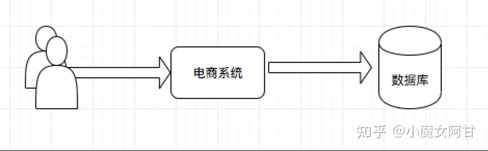
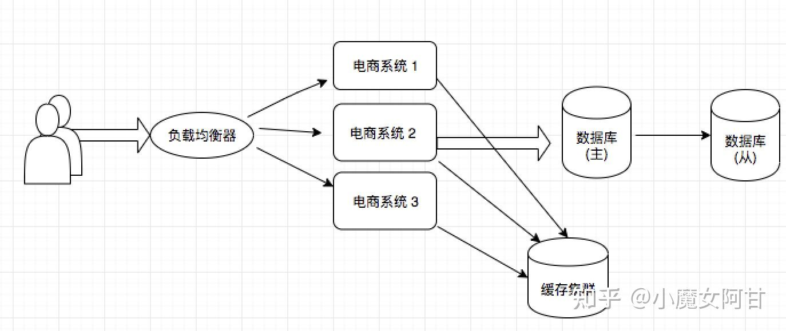
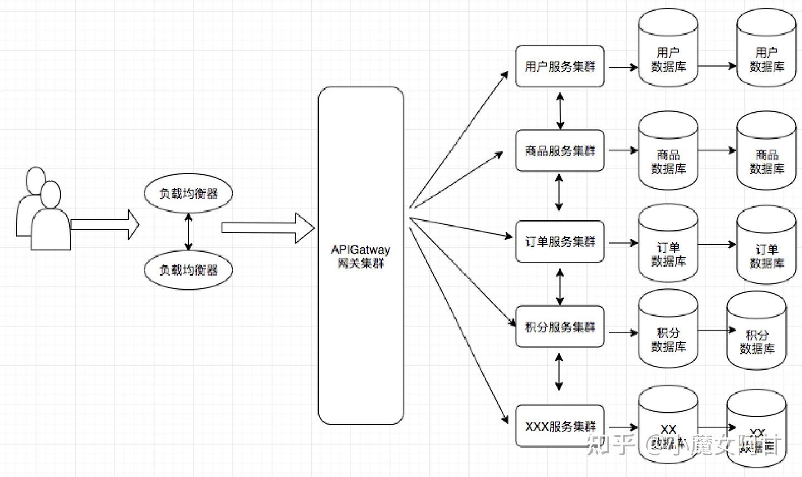

# 							OPS调研

## 1. 什么是devops

1. DevOps是Develop与Operations的缩写，它是企业内开发、技术运营和质量保障这三方面工作的融合，用于促进开发、技术运营和质保部门之间的沟通、协作与整合。

2. DevOps 的三大支柱之中，即人（People）、流程（Process）和平台（Platform）。即

   ```
   DevOps = 人 + 流程 + 平台
   ```

   人 + 流程 = 文化

   流程 + 平台 = 工具

   平台 + 人 = 赋能

3. **devops平台搭建工具**

   `项目管理（PM）`：jira。运营可以上去提问题，可以看到各个问题的完整的工作流，待解决未解决等；

   `代码管理`：gitlab。jenkins或者K8S都可以集成gitlab，进行代码管理，上线，回滚等；

   `持续集成CI（Continuous Integration）`：gitlab ci。开发人员提交了新代码之后，立刻进行构建、（单元）测试。根据测试结果，我们可以确定新代码和原有代码能否正确地集成在一起。

   `持续交付CD（Continuous Delivery）`：gitlab cd。完成单元测试后，可以把代码部署到连接数据库的 Staging 环境中更多的测试。如果代码没有问题，可以继续手动部署到生产环境中。

   `镜像仓库`：VMware Harbor，私服nexus。

   `容器`：Docker。

   `容器平台`： Rancher

   `镜像扫描`：Clairctl

   `编排`：K8S。

   `服务注册与发现`：Consul。etcd

   `脚本语言`：Python。

   `日志管理`：Cat+Sentry，还有种常用的是ELK。

   `系统监控`：Prometheus。

   `负载均衡`：Nginx。

   `网关`：Kong，zuul。

   `数据库`：MySQL redis

   `链路追踪`：Zipkin。

   `产品和UI图`：蓝湖。

   `公司内部文档`：Confluence。

   `报警`：推送到工作群。

## 2. devops概念提出

1. 单体架构+瀑布模式：单体应用架构为 LNMP，这个时候只有 DEV 没有 OPS，DEV 就是[全栈]

   

   

2. 分布式架构+敏捷开发模式：随着业务体量发展越来越大，就涉及到加人加机器。就涉及到多人协同开发，多人多机器模式。

​	


1. 多人协同开发：将一个大项目拆分成多个小板块。每个小板块分属不同分支(团队)进行开发。
2. 多机器问题：机器变多。就需要有专门的运维介入管理。

1.  微服务架构+DevOps

   

   

2. wiki定义微服务：是一种**软件架构风格**。以**小型功能区块**为基础。利用**模块化**的方式组合出复杂的大型应用程序。各功能区块使用**与语言无关的API集**相互通信

3. 一个软件从零开始到最终交付，大概包括以下几个阶段：产品规划、开发编码、构建、QA测试、发布、部署和维护。

## 1. 什么是gitops

1. GitOps 是一种实现持续交付的模型，它的核心思想是将应用系统的声明性基础架构和应用程序存放在 Git 的版本控制库中。GitOps 在运行过程中以 Git 为声明性基础架构和应用的单一事实来源。
2. **GitOps = 基础设施即代码(IaC) + 合并请求(MR) + 持续集成/持续交付(CI/CD)**
   1. **三叉戟 - 基础设施即代码(IaC) - Terraform**GitOps 使用 Git 仓库作为基础设施定义的单一可信来源，将所有基础设施以配置文件的方式存储为起来，达到配置和管理应用服务的问题。
   2. **三叉戟 - 合并请求(MR)**GitOps 使用合并请求作为所有基础设施更新的变更机制，合并请求是团队通过评审和评论进行协作的地方，合并会被提交到您的主干分支并可作为审计日志。
   3. **三叉戟 - 持续集成/持续交付(CI/CD)**GitOps 使用具有持续集成和持续交付的 Git 工作流来自动化执行基础架构的更新，在新代码合并后，CI/CD 流水线将执行环境中的更改，从而避免手动配置的错误等问题。
3. 

## 2. gitops的作用

1. GitOps体系学习和理解
   1. 版本控制核心 - 配置文件 - 声明式系统Git 仓库作为所有基础设施和应用部署代码的单一事实来源通过受保护分支的独特权限，限制可以部署到生产的用户和团队
   2. 代码审查团队 - 方便后续追溯问题原因提高代码质量，传播最佳实践，防止问题的出现
   3. 持续集成/持续交付部署 - 无缝体验 - 与 Terraform 紧密集成将其与敏捷管理和源代码管理建立在同一个应用程序中支持从物理机、虚拟机、容器到云原生平台的多种基础环境的部署

## 3. gitops的使用

1. 在典型的生命周期中，应用程序会经历多个状态，包括：
   1. 代码-->构建-->创建镜像-->测试-->发布-->
2. 而使用GitOps，这些状态将会扩展为：
   1. 部署-->在Git仓库中监控更改-->日志更改和事件-->发生更改时发出警报，并于现有的监控/告警系统集成-->更新
3. 在GitOps操作模型下，当应用程序发布时，Kubernetes需要确保其按预期运行。同时，Kubernetes通过确保其稳定性和可用性来管理应用程序的运维工作。

## 4.  GitOps的优点

1. GitOps 的优点：
   1. 快速进行变更 - 更新和回滚
   2. 人员工作体验的提升 - 部署流程完美
   3. 安全性提高 - 仓库进行权限分配合规审计容易做 - 所见即所得
2. GitOps 的缺点：
   1. 协作文化的建立 - 逐步培养
   2. Git Workflow的建立 - 混合云保证服务可用
   3. 敏感信息的处理 - 敏感信息(与Vault结合解决) - GitSecOps

## 5. GitOps工具

- Infrastructure as Code & Configuration as Code
  - [Terraform](https://links.jianshu.com/go?to=https%3A%2F%2Fyq.aliyun.com%2Fgo%2FarticleRenderRedirect%3Furl%3Dhttps%3A%2F%2Fwww.terraform.io%2F)
  - [CloudFormation](https://links.jianshu.com/go?to=https%3A%2F%2Fyq.aliyun.com%2Fgo%2FarticleRenderRedirect%3Furl%3Dhttps%3A%2F%2Faws.amazon.com%2Fcloudformation%2F)
  - [ROS](https://links.jianshu.com/go?to=https%3A%2F%2Fyq.aliyun.com%2Fgo%2FarticleRenderRedirect%3Furl%3Dhttps%3A%2F%2Fwww.alibabacloud.com%2Fproduct%2Fros)
  - [Kubernetes](https://links.jianshu.com/go?to=https%3A%2F%2Fyq.aliyun.com%2Fgo%2FarticleRenderRedirect%3Furl%3Dhttps%3A%2F%2Fkubernetes.io%2F)
  - [Chef](https://links.jianshu.com/go?to=https%3A%2F%2Fyq.aliyun.com%2Fgo%2FarticleRenderRedirect%3Furl%3Dhttps%3A%2F%2Fwww.chef.io%2F)
  - [Ansible](https://links.jianshu.com/go?to=https%3A%2F%2Fyq.aliyun.com%2Fgo%2FarticleRenderRedirect%3Furl%3Dhttps%3A%2F%2Fwww.ansible.com%2F)
- 版本控制工具
  - [GitLab](https://links.jianshu.com/go?to=https%3A%2F%2Fyq.aliyun.com%2Fgo%2FarticleRenderRedirect%3Furl%3Dhttps%3A%2F%2Fabout.gitlab.com%2F)
  - [Bitbucket](https://links.jianshu.com/go?to=https%3A%2F%2Fyq.aliyun.com%2Fgo%2FarticleRenderRedirect%3Furl%3Dhttps%3A%2F%2Fbitbucket.org%2F)
- 状态比较工具
  - [Kubediff](https://links.jianshu.com/go?to=https%3A%2F%2Fyq.aliyun.com%2Fgo%2FarticleRenderRedirect%3Furl%3Dhttps%3A%2F%2Fgithub.com%2Fweaveworks%2Fkubediff)
- 交付流水线
  - [Jenkins X](https://links.jianshu.com/go?to=https%3A%2F%2Fyq.aliyun.com%2Fgo%2FarticleRenderRedirect%3Furl%3Dhttps%3A%2F%2Fjenkins-x.io%2F)
  - [Argo CD](https://links.jianshu.com/go?to=https%3A%2F%2Fyq.aliyun.com%2Fgo%2FarticleRenderRedirect%3Furl%3Dhttps%3A%2F%2Fargoproj.github.io%2Fargo-cd%2F)
  - [Spinnaker](https://links.jianshu.com/go?to=https%3A%2F%2Fyq.aliyun.com%2Fgo%2FarticleRenderRedirect%3Furl%3Dhttps%3A%2F%2Fwww.spinnaker.io%2F)
  - tekton
  - fluxcd
  - skaffold

1. FluxCD（或Flux）是一个很棒的工具，它可以将Git和Kubernetes集成起来。Flux本质上是一个Kubernetes Operator，这意味着，你作为一个管理员可以将其安装到Kubernetes 以管理Git和原生Kubernetes之间的集成。
2. 在Kubernetes中，Flux会监控你通过配置声明的Git仓库是否发生更改，并且如果 Kubernetes Pod上在本地发生了不应发生的更改，Flux将会把Kubernetes更新到所需的运行状态。请记住，Git是事实来源。Flux Operator会检测到这一点，并将正在运行的配置更改回声明的状态。
3. 持续GitOps是四个主要组件的交集
   1. Git存储库:将应用程序的声明性定义存储为YAML的源代码存储库。
   2. Kubernetes集群:我们部署应用程序的底层集群。
   3. 同步代理:Kubernetes操作符扩展，它负责将Git存储库和应用程序状态持续同步到集群中。
   4. 持续部署管道:编排整个自动化流程的连续部署管道。
4. GitOps四项原则
   1. 以声明的方式描述整个系统：借助Kubernetes、Terraform声明系统想要达到的目标状态。工具会驱动系统向目标状态逼近。
   2. 系统的目标状态通过git进行版本控制：通过将系统的目标状态存储在具有版本控制功能的系统中，并作为唯一的事实来源，我们能够从中派生和驱动一切。
   3. 对目标状态的变更批准后将自动应用到系统：GitOps 采用拉模式更新系统状态。将做什么和怎么做分开，这样能够更加有效地划分出系统的安全边界。
   4. 驱动收敛&上报偏离：

## 1.  什么是chatops

1. chatOps最早出现在2013年。由github提出。

2. 他们发现在日常的工作中，需要不停的运行以下命令:

3. ```bash
   git checkout -b feature/xxx
   git commit -m "Bump version"
   git push origin feature/xxx
   # create pull request
   ```

   我们需要进行代码提交，确认持续集成通过，代码部署，确认各项指标正常，代码合并等一系列的繁琐工作。

   于是他们开发了`Hubot`这个机器人，来帮助他们完成这一系列的工作。

4. ChatOps表面上就是在一个聊天窗口中，发送一个命令给运维机器人bot，然后bot根据我们预定义的操作进行执行，并返回执行结果。至于更深层次的作用，就是将重复性的手工的运维工作自动化了，开发人员、运维人员可以按需执行一些运维操作。

5. [Hubot](https://link.jianshu.com/?t=https://hubot.github.com/)是Github出品的一个运维机器人。本质上就是一个接收命令消息，执行预定义操作的一个程序。而接收命令消息的这个组件在Hubot中被称为Adapter。

6. Hubot执行自定义命令

   这带来了以下的好处：

   - 信息透明化：一个操作能被团队的所有人看到，提高沟通效率
   - 寓教于做: 新的同学进入团队，能够通过观察老司机的工作方式，迅速上手
   - 提升移动办公效率：出门在外，如果紧急事项需要处理，可以通过手机迅速处理

## 2. chatops的作用

1. Hubot的理解能力比较低，采用的是`字符串匹配`的方式

2. Hubot支持适配到`Shell`， 各种聊天工具如`iMessage`, `Slack`, `QQ`，`Weixin`等

3. Hubot可以将自定义的逻辑部署在本地运行，也可以部署到云端，如`Azure`, `Heroku`。

4. 随着Hubot的兴起，一些更多的机器人开始发展起来，逐渐形成了`Hubot`，`Lita`，`Errbot`三雄争霸的场面:

   1. Hubot

      hubot运行在node.js之上，采用`Coffee Script`编写

      Lita

      Lita沿袭了Hubot的大部分特性，但区别是Ruby编写的，底层采用了Redis做存储。

      Errbot

      Python编写，支持和主流的聊天工具如Slack, Telegram等进行集成

      Errbot引入了一个`工作流` (Flow)的概念，使得在聊天软件中进行流程化操作成为可能，例如权限审批等操作。

      StackStorm（用Python开发的，github 3.8k star）StackStorm(又名“IFTTT for Ops”)是事件驱动的自动化，用于自动修复、安全响应、故障排除、部署等等。

   2. 

## 3. 如何使用chatops