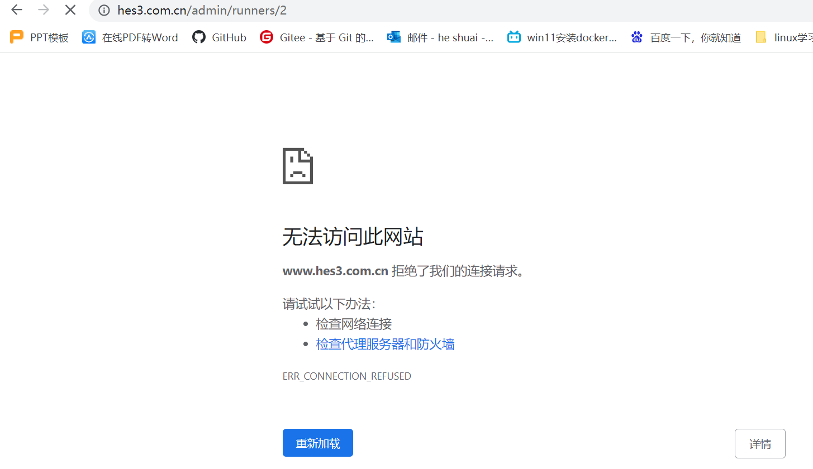
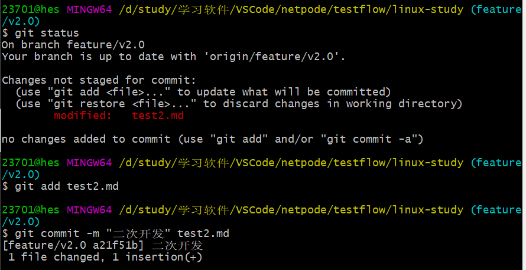
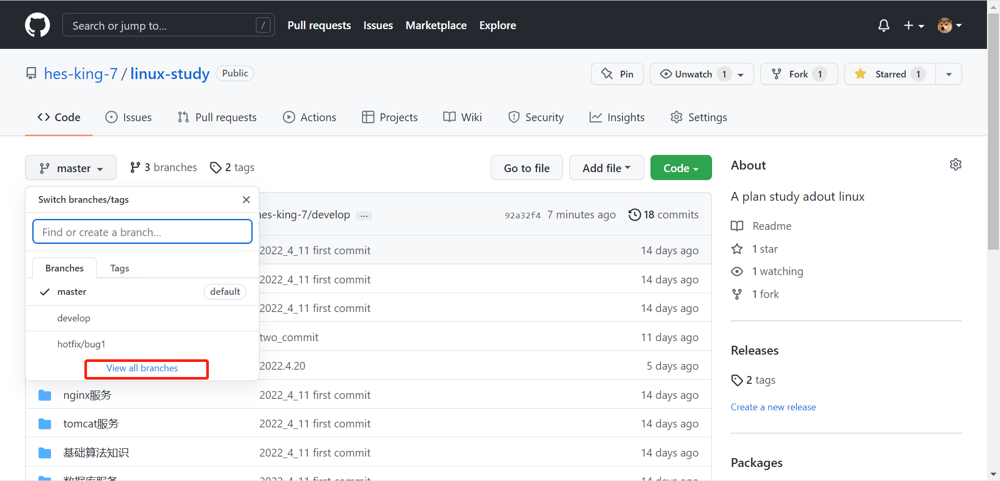
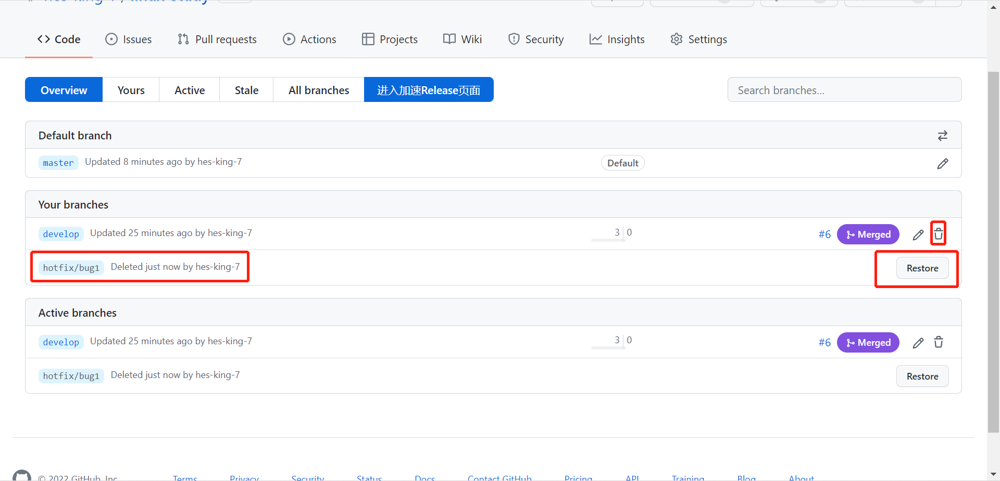

# gitlab安装使用

## gitlab简介

### 1.  gitlab介绍

#### 1. Gitlab是一种可以搭建类似于github服务平台的管理工具。更倾向于私有云。供企业私人内部管理代码

### 2.  gitlab安装

1. 实验环境准备：

   1. linux centos7.9虚拟机一台
   2. 安装配置好docker 环境
   3. 虚拟机可以正常连接外网(如不能连网需到官网手动下载好gitlab及gitlab-runner相关镜像包)

2. 安装docker-compose(非必须)

   ```css
    curl -L "https://github.com/docker/compose/releases/download/1.29.2/docker-compose-$(uname -s)-$(uname -m)" -o /usr/local/bin/docker-compose
   ### 下载安装docker-compose1.29.2版本
   [root@www ~]# chmod +x /usr/local/bin/docker-compose	##加权限
   [root@www ~]# docker-compose --version					##查看版本信息
   docker-compose version 1.29.2, build 5becea4c
   ```

3. gitlab安装步骤：**在相关环境配置完成的情况下。具体相关环境配置可自行百度**

   1. 使用docker search gitlab 命令，查找docker仓库源中包含的gitlab相关镜像包。

   2. 使用docker pull +镜像包名称:tags 下载镜像包。不指定版本默认下载latest(最新版本)

   3. 使用docker image ls查看下载好的镜像包。

   4. mkdir -p /home/gitlab/config   创建config挂载目录
      mkdir -p /home/gitlab/logs    创建logs挂载目录
      mkdir -p /home/gitlab/data    创建data挂载目录

   5. 使用 docker run --detach \               #指定容器运行于前台还是后台。detach是后台

      --hostname IP或域名 \               		#指定IP/域名(主机名)

      --publish 7001:443 --publish 7002:80 --publish 7003:22 \    

      #指定容器暴露的端口,左边的端口代表宿主机的端口，右边的是代表容器的端口

      --name gitlab \									#给容器起一个名字叫gitlab

      --restart always \								#总是重启

      --volume /home/gitlab/config/:/etc/gitlab \		#数据卷挂载。左边宿主机。右边容器内

      --volume /home/gitlab/logs/:/var/log/gitlab \

      --volume /home/gitlab/data/:/var/opt/gitlab 	46cd6954564a(镜像包ID值)

   6. 启动容器后，在宿主机内cd  /home/gitlab/config/      #切换到容器对应挂载宿主机的配置相关目录，修改config目录下的gitlab.rb配置文件。**提醒。修改配置前可先cp gitlab.rb gitlab.rb.bak。为配置文件做个cp备份。放在修改出错不可逆** 。使用vim gitlab.rb命令进入配置文件后，找到以下位置。进行相关配置修改

   7. external_url = 'ip/主机名' **推荐使用IP**。

      gitlab_rails['gitlab_shell_ssh_port'] = 7003	#修改容器ssl端口为映射的宿主机端口。后保存配置。

   8. 然后重新进入gitlab容器                           docker exec -it gitlab /bin/bash

   9. 在容器内重置gitlab客户端                        gitlab-ctl reconfigure

   10. 重置完成后退出容器                                  exit

   11. 然后在容器宿主机上重启gitlab容器         docker restart gitlab   

   12. 重启后可以通过docker ps命令查看容器是否已启动。通过netstat -ntpl命令查看容器相关端口是否正常被监听。配置完成后。既可在真实主机下(推荐使用)google浏览器输入docker ip+映射端口/域名。进行gitlab页面访问选项。

       

   13. 出现此页面即说明gitlab容器启动成功。**(开始登录时页面报错502.经百度查询告知原因可能有两种，一、宿主机内存给的不够(默认建议给2-4G或以上)。二、端口被占用。也就是说你容器端口或映射端口有被其他服务占用。导致端口冲突。这个时候我们就可以使用netstat -ntpl查看是否有端口被其他服务占用，如果被占用，可以kill掉其它服务。或者重新配置容器端口。我这里的错误原因后经查证是因为容器刚起来，还在缓读内存才导致的。这个时候多等一会再从新刷新网页即可。）**

   14. 页面出来后可以输入默认的用户名root和密码(**root默认密码存储位置在/home/gitlab/config/initial_root_password内**。使用cat命令查看即可。此文件将在首次执行reconfigure后24小时内自动删除。所以我们使用此密码首次登录后建议先进web页面给root重新配置密码。)

   15. 拿到密码后在web页面输入用户名和密码登录进入。

       

   16. 进入后首页如下。后找到修改密码界面对root用户密码进行修改操作。

       

       

       

       

   17. 修改完后，点击下面的保存配置即可，其它信息可暂时不改。修改完后会重新跳回登录界面。这时候我们使用root+修改后的密码登录即可。到此。一个简单的gitlab容器实例搭建完成。

### 3.  gitlab使用配置

​			gitlab搭建完成后。我们可以对其进行功能操作实验。

#### 3.1 SSH公钥部署

1. 在本机打开git命令行，输入 ssh-keygen -t rsa -C "bv_test"。生成一对ssh密钥。其中id_rsa是本地保存私钥。id_rsa.pub是在gitlab添加的公钥。复制信息粘贴到gitlab上即可。

   

   

   

   

   

   

   

   一个gitlab/github上可以添加多个ssh-key。但是一个key只能对应一个主机。

   

   

   - github账户中的SSH keys，相当于这个账号的最高级key，只要是这个账号有的权限（任何项目），都能进行操作。

   - 仓库的Deploy keys，就是这个仓库专有的key，用这个key，只能操作这个项目，其他项目没有权限。

   - 报错信息：此信息提示SSH KEY已被注册。意即一个key只可用于一个SSH或deploy keys

   - #### The form contains the following error:

     - Fingerprint has already been taken

   到此。ssh-key已配置完成。后面本机就可以免用户密码直接和gitlab/github上传下载代码了

### 4.  功能点测试

#### 4.1 gitlab数据备份测试

** 测试数据备份操作。(docker容器环境下)

1. 首先进入自己的gitlab容器内。 docker exec -it gitlab /bin/bash

2. 查找到gitlab默认存储数据目录。/var/opt/gitlab/git-data/

3. 停止gitlab服务数据

   ```
   root@www:/var/opt/gitlab/git-data# gitlab-ctl status			##查看状态
   root@www:/var/opt/gitlab/git-data# gitlab-ctl stop unicorn		##停止un(新版本已被puma替代。使用status命令可查看是否有puma服务。若有，则说明已使用puma)
   root@www:/var/opt/gitlab/git-data# gitlab-ctl stop sidekiq		##停止队列
   ok: down: sidekiq: 0s, normally up
   root@www:/var/opt/gitlab/git-data# gitlab-ctl stop puma			##停止puma(网页登录)
   ok: down: puma: 1s, normally up
   ```

4. 停止后网页报错502.等后续重启即可。

   ```
   root@www:/var/opt/gitlab/backups# gitlab-rake gitlab:backup:create
   ## 手动备份命令
   root@www:/var/opt/gitlab/backups# ll
   total 344
   drwx------  2 git  root     60 Apr 18 04:49 ./
   drwxr-xr-x 20 root root   4096 Apr 18 03:48 ../
   -rw-------  1 git  git  348160 Apr 18 04:49 1650257368_2022_04_18_14.6.1_gitlab_backup.tar		##备份生成的文件。
   root@www:/var/opt/gitlab/backups# gitlab-ctl start	##启动gitlab服务
   ```

5. 删除数据库

   

   

#### 4.2 数据恢复

```css
root@www:/var/opt/gitlab/backups# gitlab-ctl stop puma		
ok: down: puma: 1s, normally up
root@www:/var/opt/gitlab/backups# gitlab-ctl stop sidekiq
ok: down: sidekiq: 0s, normally up
```


指定恢复那个备份数据。恢复期间要输入两次yes。


恢复之后重启gitlab然后进网页查看是否恢复。

```css
root@www:/var/opt/gitlab/backups# gitlab-ctl start sidekip
root@www:/var/opt/gitlab/backups# gitlab-ctl start puma
ok: run: puma: (pid 6536) 0s
```


#### 4.3 测试新建用户，组和项目

1. 新建用户

   

   

2. 新建组

   

   

3. 新建项目

   

   

   

### 5. Gitlab CI/CD

1. Gitlab CI/CD是一个内置在gitlab中的工具。通过持续方法进行软件开发：
   1. Continuous Integration ：持续集成
   2. Continuous delivery ：      持续交付
   3. Continuous Deployment：持续部署

2. 持续集成原理是将小代码块推送到git仓库中托管，并且每次推送，都要运行一系列脚本构建、测试和验证等。然后再合并到主分支。
3. 持续交付和部署相当于进一步的持续集成。可以把代码推送到仓库默认分支的同时将应用程序部署到生产环境。
4. CI/CD由gitlab-ci.yml文件进行配置。位于仓库的根目录下。指定脚本由gitlab runner执行。
5. gitlab至少包含三部分：一个gitlab实例、一个gitlab runner、一个gitlab-ci文件。
6. 一条流水线(pipeline)包含多个阶段(stage)。一个阶段又包含多个任务(job)任务是流水线最小单元。.gitlab-ci.yml是执行一个job的具体内容。

### 6. Gitlab runner

1. Gitlab-Runner是配合Gitlab-CI进行使用的一个用来执行软件集成脚本的东西。用于运行任务作业并将结果发送回gitlab。Gitlab-ci就是一套配合Gitlab使用的持续集成系统。
2. gitlab runner主要分三种
   1. shared： 运行整个gitlab平台项目的作业
   2. group：   运行特定group下的所有项目的作业
   3. specific： 运行指定的项目作业
3. Gitlab Runner两种状态
   1. locked：无法运行项目作业
   2. paused：不会运行作业
4. 使用docker起一个gitlab-runner容器。

```
[root@www ~]# docker run -itd  --restart=always --name gitlab-runner \
> -v /data/gitlab-runner/config/:/etc/gitlab-runner \
> -v /var/run/docker.sock:/var/run/docker.sock 77a7b2f30dd5(gitlab-runner镜像ID值。跟镜像名亦可。)
899afa5f374cdf1c96c17ca41ac7ef5d5e89e0fc7c4f381f6434bb07efc9fd22
[root@www ~]# docker exec -it gitlab-runner /bin/bash
root@899afa5f374c:/# gitlab-runner -v
Version:      14.6.0
Git revision: 5316d4ac
Git branch:   14-6-stable
GO version:   go1.13.8
Built:        2021-12-17T17:35:51+0000
OS/Arch:      linux/amd64
```

1. gitlab-runner向gitlab注册。

   **注册前提必须有一个可以使用的gitlab仓库。

2. 点击用户管理。选择项目管理，选择项目进入。在项目里面找到settings-->CI/CD-->Runners。找到仓库路径和token值。

   

   ```css
   root@899afa5f374c:/# gitlab-runner register		##注册命令
   Runtime platform                                    arch=amd64 os=linux pid=32 revision=5316d4ac version=14.6.0
   Running in system-mode.
   
   Enter the GitLab instance URL (for example, https://gitlab.com/):
   http://192.168.200.102:7002/		##填写gitlab仓库url路径
   Enter the registration token:
   TAsNToZzJvUCfmo_XPx6				##填写对应的token值
   Enter a description for the runner:
   [899afa5f374c]: node1.hes1.com^H	##对此runner的描述
   Enter tags for the runner (comma-separated):
   hes1								##给此runner打标签
   Registering runner... succeeded                     runner=TAsNToZz
   Enter an executor: custom, docker, parallels, virtualbox, docker-ssh, shell, ssh, docker+machine, docker-ssh+machine, kubernetes:
   docker								##指定执行方式，这里选docker。如果宿主机直接安装建议选shell。
   Enter the default Docker image (for example, ruby:2.6):
   ruby:2.6		##**这里的镜像信息是后面ci文件内容执行的默认容器的底层镜像。所以一定要指对。比如我们ci文件内要跑的内容为shell脚本。那么此镜像就必须有包含shell解释器的镜像才行。
   Runner registered successfully. Feel free to start it, but if it's running already the config should be automatically reloaded!
   ```

   ```css
   root@899afa5f374c:/# gitlab-runner restart		##重启runner
   Runtime platform                                    arch=amd64 os=linux pid=43 revision=5316d4ac version=14.6.0
   root@899afa5f374c:/# gitlab-runner list			##list列出runner信息。
   Runtime platform                                    arch=amd64 os=linux pid=78 revision=5316d4ac version=14.6.0
   Listing configured runners                          ConfigFile=/etc/gitlab-runner/config.toml
   node1.hes1.co                                     Executor=docker Token=VGurpzrQsCbLMarnQrUs URL=http://192.168.200.102:7002/
   ```

   

   **runner注册完成后会在 /etc/gitlab-runner目录下生成一个config.toml的文件。这个就是runner的配置文件。因为在安装runner的时候我们已经将配置文件的目录通过挂载的形式映射到了宿主机目录：/data/gitlab-runner/config 下，所以后续如果需要更新runner配置文件可以直接在宿主机上进行修改。并且在宿主机上进行修改runner配置文件不需要重启runner。它会每5分钟检查一次文件自动获取所有更改。包括该[[runners]]部分中定义的任何参数以及全局部分中的大多数参数（除外）listen_address。**

   配置如下：

   ```css
   root@899afa5f374c:/etc/gitlab-runner# cat config.toml
   concurrent = 1
   check_interval = 0
   
   [session_server]
     session_timeout = 1800
   
   [[runners]]
     name = "node1.hes1.co"
     url = "http://192.168.200.102:7002/"	##你的gitlab访问url地址
     token = "VGurpzrQsCbLMarnQrUs"		##在gitlab的ui上看到的token
     executor = "docker"
     [runners.custom_build_dir]
     [runners.cache]
       [runners.cache.s3]
       [runners.cache.gcs]
       [runners.cache.azure]
     [runners.docker]
       tls_verify = false
       image = "latest"
       privileged = false
       disable_entrypoint_overwrite = false
       oom_kill_disable = false
       disable_cache = false
       volumes = ["/cache"]
       shm_size = 0
   root@899afa5f374c:/etc/gitlab-runner#
   ```

3. 注册完成后，返回gitlab的ui查看runner信息。而且一个是shared。一个是group模式。

   

   在点击runner时报错.这个时候我们可以去这台访问主机(win真实主机的hosts文件进行一下gitlab容器启动的虚拟级的IP和域名指定即可。测试方法。正常方法应该是搭建一个DNS服务器。通过DNS服务器进行域名解析)

   

   **当此时都可访问域名，但是当我像做gitlab-runner配置时，提示报错。

   

   然后我们在仓库的根目录添加一个.gitlab-ci.yml文件后。在.gitlab-ci.yml中写入需要执行的任务脚本信息。然后到CI/CD-->pipelines中查看执行的流水线，在jobs中查看具体的任务信息。

   

   

   

   

   

   

   

   

   

   

4. 此时我们可以看到一条简单的流水线就这个完成。(**为什么镜像要指ruby:2.7。还需要调研。当我指定我宿主机已经下载好的其它镜像，并在ci中指定镜像名称后，发现执行job时还是显示要pull这个镜像。而不是找本地宿主机下载好的镜像。从而导致失败。这个也是个疑问。)

   解决办法：

   

   

   

   ```css
   concurrent = 1
   check_interval = 0
   
   [session_server]
     session_timeout = 1800
   
   [[runners]]
     name = "gitlab-1"
     url = "http://192.168.200.101/"
     token = "Mds84XaC42MmULubcCT5"
     executor = "docker"
     [runners.custom_build_dir]
     [runners.cache]
       [runners.cache.s3]
       [runners.cache.gcs]
       [runners.cache.azure]
     [runners.docker]
       tls_verify = false
       image = "ruby:2.7"
       privileged = false
       disable_entrypoint_overwrite = false
       oom_kill_disable = false
       disable_cache = false
       volumes = ["/cache"]
       pull_policy = "if-not-present"		##添加此命令，取消运行runner时下载镜像操作。如果本地没有ci文件中指定的镜像，再去下载。
       exter_hosts = ["www.hes2.com.cn:192.168.200.101"]	##添加IP对应的域名
       shm_size = 0
   ```

4. 


### 7. GitLFS

#### 7.1GitLFS简介：

1. GitLFS(git 大文件存储，Large File Storage，简称LFS)目的是更好的把大型二进制文件。视频等资源集成到git工作流中。git存储二进制文件的所有版本，所以效率不高。而lfs用文本指针替换。这些指针包含二进制文件信息的文本文件。指针存储在git中。而大文件本身通过https托管在git lfs服务器上。
2. **手动开启步骤：在gitlab(14.6.1)web页面上未找到gitlfs开启位置？**
3. 文件存储位置：

```css
### Git LFS
gitlab_rails['lfs_enabled'] = true
gitlab_rails['lfs_storage_path'] = "/var/opt/gitlab/gitlab-rails/shared/lfs-objects"(默认配置目录。修改为其它配置目录后重启gitlab服务会导致gitlab容器一直重启。)
```

​	仓库被删除之后。lfs文件并未删除，而是仍然存放在服务器上面。

#### 7.2 测试步骤

##### 	测试环境

```ccs
[root@www ~]# git lfs install
Git LFS initialized.								##git lfs已安装
[root@www ~]# git --version
git version 2.18.0									##git版本信息
root@www:/# cat /opt/gitlab/embedded/service/gitlab-rails/VERSION
14.6.1												##gitlab版本信息
[root@www gitlab]# git lfs --version
git-lfs/3.1.2 (GitHub; linux amd64; go 1.17.6)		##git-lfs版本信息
```

1. 环境搭好后。我们先在gitlab上新创建一个gitlfs_test仓库。

2. 在本地新建一个test1的空文件夹。使用git clone +仓库地址将仓库克隆到本地此文件夹。

   ```css
   git clone http://www.hes3.com.cn/developer_jsb/gitlfs_test.git
   正克隆到 'gitlfs_test'...
   fatal: unable to access 'http://www.hes3.com.cn/developer_jsb/gitlfs_test.git/': Failed connect to www.hes3.com.cn:80; 拒绝连接				##使用http地址显示连接被拒绝。我们就换ssh地址clone。
   [root@www gitlfs_test]# git clone ssh://git@www.hes3.com.cn:7003/developer_jsb/gitlfs_test.git
   正克隆到 'gitlfs_test'...
   remote: Enumerating objects: 3, done.
   remote: Counting objects: 100% (3/3), done.
   remote: Total 3 (delta 0), reused 0 (delta 0), pack-reused 0
   接收对象中: 100% (3/3), 完成.				##显示克隆成功。
   ```

3. 然后我们在此文件夹下上传几个.mp4格式的视频大文件。使用 git lfs track "*.mp4"追踪。追查完成后会默认在根目录生成一个.gitattributes文件。我们可以使用cat 命令查看文件信息.也可以使用git lfs ls-files命令查看被追踪文件。

   ```css
   [root@www gitlfs_test]# cat .gitattributes
   *.mp4 filter=lfs diff=lfs merge=lfs -text
   [root@www gitlfs_test]# git lfs ls-files
   82c0b167e4 * 20220301_235820.mp4
   327e9b6eaa * 20220302_003435.mp4
   6173dd755a * 20220302_210308.mp4
   ```

4. 接下来我们使用git add 文件名/. 来添加修改过的文件。(.代表全部)

5. 使用git commit -m “描述信息”   文件名/.         提交信息。

6. 使用git status 查看状态。

7. 使用git push +远程仓库名 +远程仓库地址/远程分支名称 将新的内容推送到远程仓库。

   ```css
   [root@www gitlfs_test]# git push origin main
   batch response: Post "http://www.hes3.com.cn/developer_jsb/gitlfs_test.git/info/lfs/objects/batch": dial tcp 192.168.200.102:80: connect: connection refused
   error: 无法推送一些引用到 'ssh://git@www.hes3.com.cn:7003/developer_jsb/gitlfs_test.git
   ```

   **提示报错，80端口被拒绝。和一些引用无法推送**。

   ```css
   [root@www gitlfs_test]# git remote set-url origin 				git://git@www.hes3.com.cn:7003/developer_jsb/gitlfs_test.git
   ### 设置默认远程方式为ssh方式
   [root@www gitlfs_test]# git config --get remote.origin.url
   git://git@www.hes3.com.cn:7003/developer_jsb/gitlfs_test.git
   ### 查看默认远程方式
   [root@www gitlfs_test]# git push -u origin main
   fatal: Unable to look up git@www.hes3.com.cn (port 7003) (未知的名称或服务)
   ### 使用ssh远程推送方式推送。 
   ```

   **报错，未知的名称或服务**.

8. 这种情况下，我这边的做法。从新打开一个gitlab容器。将容器端口的80直接映射为宿主机的80端口。然后重新git clone。

   ```css
   [root@www gitlfs_test]# git branch -r			##git clone之后查看远程分支
     origin/HEAD -> origin/main
     origin/main
   [root@www gitlfs_test]# git remote rm origin		##删除远程分支
   [root@www gitlfs_test]# git branch
   * main
   [root@www gitlfs_test]# git branch -r
   [root@www gitlfs_test]# git status					##查看状态
   # 位于分支 main
   无文件要提交，干净的工作区
   [root@www gitlfs_test]# ls
   20220420_204128.mp4  20220420_210957.mp4  20220420_231142.mp4
   20220420_210547.mp4  20220420_212735.mp4  README.md
   [root@www gitlfs_test]# git remote add origin 		##添加远程分支	http://192.168.200.101/root/gitlfs_test.git
   [root@www gitlfs_test]# git remote -v				##查看分支别名
   origin  http://192.168.200.101/root/gitlfs_test.git (fetch)
   origin  http://192.168.200.101/root/gitlfs_test.git (push)
   [root@www gitlfs_test]# git branch					##查看本地分支
     develop
   * main
   [root@www gitlfs_test]# git push -u origin main		##推送本地代码到远程main分支
   Username for 'http://192.168.200.101': root			##输入用户名
   Password for 'http://root@192.168.200.101':			##输入密码
   Locking support detected on remote "origin". Consider enabling it with:
     $ git config lfs.http://192.168.200.101/root/gitlfs_test.git/info/lfs.locksverify true
   To http://192.168.200.101/root/gitlfs_test.git MB/s
    ! [rejected]        main -> main (fetch first)
   error: 无法推送一些引用到 'http://192.168.200.101/root/gitlfs_test.git'
   提示：更新被拒绝，因为远程版本库包含您本地尚不存在的提交。这通常是因为另外
   提示：一个版本库已推送了相同的引用。再次推送前，您可能需要先合并远程变更
   提示：（如 'git pull'）。
   提示：详见 'git push --help' 中的 'Note about fast-forwards' 小节。
   [root@www gitlfs_test]# git pull				##先pull远程分支仓库使本地仓库和远程仓库信息保持一致。
   Username for 'http://192.168.200.101': root
   Password for 'http://root@192.168.200.101':
   remote: Enumerating objects: 14, done.
   remote: Counting objects: 100% (14/14), done.
   remote: Compressing objects: 100% (12/12), done.
   remote: Total 12 (delta 4), reused 0 (delta 0), pack-reused 0
   Unpacking objects: 100% (12/12), done.
   来自 http://192.168.200.101/root/gitlfs_test
    * [新分支]          main       -> origin/main
   There is no tracking information for the current branch.
   Please specify which branch you want to merge with.
   See git-pull(1) for details
   
       git pull <remote> <branch>
   
   If you wish to set tracking information for this branch you can do so with:
   
       git branch --set-upstream-to=origin/<branch> main
   [root@www gitlfs_test]# git push		##提示没有对应的上游main分支
   fatal: 当前分支 main 没有对应的上游分支。
   为推送当前分支并建立与远程上游的跟踪，使用
   
       git push --set-upstream origin main
   [root@www gitlfs_test]# git push --set-upstream origin main		##推送并设置对应的上游分支
   Username for 'http://192.168.200.101': root			##输入用户名
   Password for 'http://root@192.168.200.101':			##输入密码
   Locking support detected on remote "origin". Consider enabling it with:
     $ git config lfs.http://192.168.200.101/root/gitlfs_test.git/info/lfs.locksverify true
   Uploading LFS objects: 100% (5/5), 355 MB | 0 B/s, done.
   Counting objects: 12, done.
   Delta compression using up to 2 threads.
   Compressing objects: 100% (9/9), done.
   Writing objects: 100% (10/10), 1.35 KiB | 0 bytes/s, done.
   Total 10 (delta 1), reused 0 (delta 0)
   To http://192.168.200.101/root/gitlfs_test.git
      e22b09f..0333d9a  main -> main
   分支 main 设置为跟踪来自 origin 的远程分支 main。		##到此显示上传成功
   [root@www gitlfs_test]# git config credential.helper store	##如果不想每次输入用户名和密码，则可以使用credential.helper（凭证助手）来记住Username和Password
   [root@www gitlfs_test]# git push -u origin main		##再次git push一遍
   Username for 'http://192.168.200.101': root			##输入用户名
   Password for 'http://root@192.168.200.101':			##输入密码
   分支 main 设置为跟踪来自 origin 的远程分支 main。
   Everything up-to-date								##显示已上传
   [root@www gitlfs_test]# git push					##这时候我们再从新git push就发现已经没有提示需要我们输入username和password了。
   Everything up-to-date
   git config --global credential.helper 'cache --timeout 7200'    ##这里设置账号信息被记住7200秒，两个小时。
   ```

   

9. 登录我们的gitlab对应的仓库查看。也可以看到标记的.mp4格式的文件使用的是LFS存储了。

12. 

### 8. Gitlab Flow

####   1. 什么是GitFlow

1.  Git Flow定义了一个项目发布的分支模型，为管理具有预定发布周期的大型项目提供了一个健壮的框架，是由 Vincent Driessen 提出的一个 git操作流程标准、解决当分支过多时 , 如何有效快速管理这些分支。

#### 	2. GitFlow的优势

  		1. **并行开发**：每个新功能都会建立一个新的 feature分支，从而和已经完成的功能隔离开来，而且只有在新功能完成开发的情况下，其对应的feature分支才会合并到主开发分支上（也就是我们经常说的develop分支）。另外，如果你正在开发某个功能，同时又有一个新的功能需要开发，你只需要提交当前 feature 的代码，然后创建另外一个feature 分支并完成新功能开发。然后再切回之前的 feature 分支即可继续完成之前功能的开发。
  		2. **协作开发**：GitFlow 还支持多人协同开发，因为每个 feature 分支上改动的代码都只是为了让某个新的 feature 可以独立运行。同时我们也很容易知道每个人都在干啥。
  		3. **阶段式发布**：
  		4. 当一个新 feature 开发完成的时候，它会被合并到 develop 分支，这个分支主要用来暂时保存那些还没有发布的内容，所以如果需要再开发新的 feature，我们只需要从 develop 分支创建新分支，即可包含所有已经完成的 feature 。
  		5. **支持紧急修复**：GitFlow 还包含了 hotfix 分支。这种类型的分支是从master上创建出来并做一个紧急的修复，而且这个紧急修复只影响这个已经发布的 tag，而不会影响到你正在开发的新 feature。

#### 	3. GitFlow基本分支

	1. master：主分支。存放所有正式发布的版本。不直接提交代码。仅用于保持一个对应线上运行代码的code base。只能从其它分支合并，不能直接修改。
	1. develop：主开发分支。不直接提交代码。包含所有要发布到下一个Release的代码，这个主要合并与其他分支，比如Feature分支‌
	1. feature：功能分支。主要是用来开发一个新的功能，一旦开发完成，我们合并回Develop分支进入下一个Release‌。可以同时有多个。
	1. release：发布分支。当你需要发布一个新功能的时候，要基于Develop分支创建一个Release分支，在Release分支测试并修复bug，完成release后，把release合并到master和develop分支‌。一旦打了release分支之后不要从develop分支上合并新的改动到release分支，同一时间只有1个，生命周期很短，只是为了发布。
	1. hotfix：补丁分支。当我们在生产环境发现新的Bug时候，我们需要基于master分支创建一个Hotfix分支，然后在Hotfix分支上修复bug，完成Hotfix后，我们要把hotfix分支合并回Master和Develop分支‌。如果当前还有新功能release分支，也同步到release分支上。同一时间只有1个，生命周期较短。

#### 	4. GitFlow如何工作

1. 当我们新建git仓库之后，默认会创建一个主分支也就是master分支，由于master分支是用于发布生产环境，所有必须保证master上代码的稳定性，所以我们不能直接在master分支上修改提交。我们要基于master分支创建一个develop分支，develop分支用于保存开发好的相对稳定的功能，master分支和develop分支是仓库的常驻分支，一直会保留在仓库中

   

2. 当新的开发任务来了之后，就要编写代码了，我们尽量不要在develop分支上写代码，要保证develop分支的相对稳定，所以这时我要就要基于develop 分支创建一个临时的开发分支，然后在开发分支上编写代码，等功能开发完之后我们再把开发分支合并到develop上

   

3. 新功能合并到develop分支之后，我们想把新功能发布到生产环境，首先基于develop分支创建release分支，然后在release分支测试完成之后，把release分别合并到master分支和develop分支。

   

4. release分支合并到master分支之后，在master分支上打标签用于发布：

   

5. 我们把代码发布到了生产环境，用户在使用的时候给我们反馈了一个bug，这时我们需要基于master分支创建一个hotfix 分支，用于修复bug，bug修好之后，把hotfix 分支分别合并到master分支和develop分支。（或者当我们再进行测试的时候就出现了bug。这个时候我们就会基于develop分支创建一个fix-xxx分支。用于bug修复。完成后合并develop并删除。）

   

6. 如果你理解了上面的流程，你完全可以不使用Git flow工具，但是如果你想更标准化的执行git flow，可以尝试使用git flow工具‌。

#### 	5. GitFlow工具安装

1.  Mac OS X

   ```css
   $ brew install git-flow
   ```

2. Linux

   ```css
   $ apt-get install git-flow		##ubuntu环境
   $ yum install git-flow -y		##centos环境  要先下载包。
   ```

3. windows

   ```css
   $ wget -q -O - --no-check-certificate https://github.com/nvie/gitflow/raw/develop/contrib/gitflow-installer.sh | bash
   ```

#### 	6. 使用

1. 先在本地新建一个文件夹名称叫gitflow(相当于本地新的仓库)-->右键Git Bash Here打开git命令行。使用git clone +github/itlab仓库地址。克隆远程仓库到本地。使用git flow init命令初始化本地仓库。并生成git flow分支管理。(一直enter即可)。

   

2. 初始化之后会自动切换进develop分支。首先在本地develop分支查看是否有本地master分支(因为是clone所以本地master分支和远程master内容一致)内容。

   

3. 在本地develop分支上查看远程分支。和对于的别名。

   

   

4. **◆****新功能开发,代号v2.0**

   任何开发都必须基于develop分支:git flow feature start v2.0。构建成功后自动切换到feature分支。在feature分支可以看到也继承了上游develop分支的所有内容。

   

5. 测试在本地feature分支上新建一个文件并提交查看状态。

   

6. 测试本地合并到上游develop分支效果。(**注意：合并操作在上游分支进行。由下游分支向上游合并)。合并成功后可以看到develop分支也有了新添加的内容。

   

   

7. 这时我们把新的内容上传到远程。提示我们远程分支上还没有对应的develop分支。

   

8. 这时我们使用提示命令。上传的同时创建对应的远程develop分支。

   

   

9. 上传完成后我们到远程分支上查看。master分支还没有develop分支新添加的test2.md文件。

   

   

10. 在远程上把develop分支新内容和远程master分支进行拉取请求和对比文件的差异。合并到远程

    

    

    

    

    

    

11. 远程新建了develop分支，并把develop分支新的内容merge到master分支。

12. 推送分支到远程仓库：git flow feature publish V1.0或者

    git push --set—upstream origin feature/V1.0。在远程上也可以看到新的feature分支。

    

13. 在本地feature分支进行新的功能测试命令。如

    

    

    

14. 完成功能开发后使用: git flow feature finish +名称。(feature/v2.0 分支的代码会被合并到 develop 里面，然后删除该分支，切换回 develop，此时develop并未推送到远程仓库。需执行git push进行推送。)

    

15. 删除本地不要的多余分支

    

    

16. 将新增功能从本地develop分支上传到远程develop分支。远程master分支需要merge后才有。

    

    

    

17. 将新增内容从远程develop分支merge到远程master分支。

    

    

    到这里我相信各位都知道后面的合并步骤了把，和上面一样。我就不再演示。再回到master查看。可以看到已合并完成。

    

18. **完成release测试**：步骤和命令与feature基本相同。将feature改为release即可。(需要注意。release分支也是基于develop分支创建.)release分支finish完后会自动将代码merge到master 和 develop 分支,将本地和远程仓库的release/1.0删除(需手动),自动打包.

    

    

    

    

    

    

    finish的时候会提示此信息，将1前面的#去掉保持文档就好。

    

    

    推送tag至仓库**:git push origin --tags****发布tag 1.0上线**

    

    

    

    

19. **◆紧急 bug 修正，代号bug1**

    基于master，开启热修复分支：git flow hotfix start bug1

    

    

    

    

    

    

    

    

    

    

20. **推送develop/master分支至远程仓库：git push**(合并完成后需手动删除hotfix分支)

    

    

    

    

21. **推送tag至远程仓库**： git push origin ---tags.没有推送之前我们可以看到tag还是只有一个。

    

    

    

    

    

    

    

    

22. 

- **初始化:** git flow init
- **开始新Feature:** git flow feature start MYFEATURE
- **Publish一个Feature(也就是push到远程):** git flow feature publish MYFEATURE
- **获取Publish的Feature:** git flow feature pull origin MYFEATURE
- **完成一个Feature:** git flow feature finish MYFEATURE
- **开始一个Release:** git flow release start RELEASE [BASE]
- **Publish一个Release:** git flow release publish RELEASE
- **发布Release:** git flow release finish RELEASE 别忘了git push --tags
- **开始一个Hotfix:** git flow hotfix start VERSION [BASENAME]
- **发布一个Hotfix:** git flow hotfix finish VERSION
- **删除分支**：git branch -d +分支名 。(-D强制删除)

### 9. 


